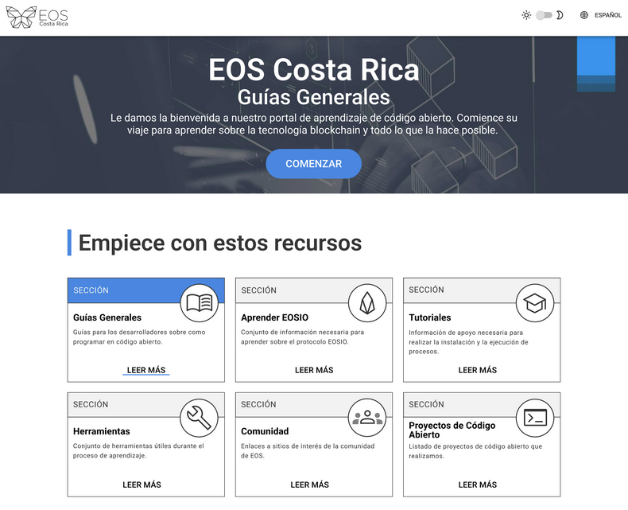

# guias.eoscostarica.io
<!-- ALL-CONTRIBUTORS-BADGE:START - Do not remove or modify this section -->
[](#contributors-)
<!-- ALL-CONTRIBUTORS-BADGE:END -->

Sitio de documentación para desarrolladores de EOS Costa Rica.



## Sobre el Proyecto

En este sitio se encuentran los recursos recolectados en el día a día de los colaboradores de EOS Costa Rica. Siéntete libre de colaborar, comentar y sugerir cambios/ideas para mejorar el sitio.

## Tabla de Contenido

1. Sobre el Proyecto
2. Tabla de Contenido
3. Objetivo del Proyecto
4. Versión
5. Tech Stack
6. Entorno de Desarrollo
7. Estructura de Archivo
8. Licencia
9. Contribuciones
10. Colaboradores
11. Acerca de EOS Costa Rica

## Objetivo del Proyecto

Este proyecto está destinado a servir como una herramienta para ayudar en la incorporación de nuevos desarrolladores. Creado inicialmente por un grupo de estudiantes universitarios para facilitar una guía a otros miembros del equipo y contribuir en proyectos de código abierto. Su objetivo principal es brindar orientación a los nuevos miembros del equipo y acelerar el proceso de familiarización con los procesos y la cultura en EOS Costa Rica.

## Versión
:::nota
Estamos en version 0.2.0
:::

## Tech Stack
- React.js - React 16✨, React Router 5
- Material-ui/core - Componentes de React para un desarrollo web más rápido y fácil, biblioteca-autenticador-universal - Una biblioteca para permitir que las aplicaciones utilicen fácilmente diferentes proveedores de autenticación
- Core - Componentes de React para un desarrollo web más rápido y sencillo
- Lint- ESlint
- Estilos - Tema Material-UI (personalizable)

### Empezando

Dé las instrucciones necesarias para ejecutar el proyecto localmente, por ejemplo:

#### **Requisitos Previos**

- `yarn`
- `git`
- `node.js`

#### **Instalación**

1. Clona el repositorio

  `
  git clone https://github.com/eoscostarica/guias.eoscostarica.io.git
  `

2. Mover el directorio apropiado

  `
  cd guide.eoscostarica.io.git
  `

3. Instale los paquetes de yarn

  `
  yarn
  `

4. Ejecute el proyecto

  `
  yarn start
  `

### Estructura de archivos

```sh
guias.eoscostarica.io/
├── .github
│ ├── workflows
│ | ├── nodejs.yml
│ | └── services
│ └── pull_request_template.md
├── docs
├── src
│ ├── css
│ | ├── custom.css
│ | └── homepage.css
│ └── pages
│   └── index.js
├── static
│ ├── img
│ ├── scripts
│ └── CNAME
├── .all-contributorsrc
├── .gitignore
├── docusaurus.config.js
├── package.json
├── yarn.lock
└── README.md
```

## Licencia

MIT © [EOS Costa Rica](https://eoscostarica.io)

## Contribuciones 

Usamos un tablero estilo Kanban. Ahí es donde priorizamos el trabajo. [Tablero de trabajo](https://github.com/orgs/eoscostarica/projects/2).


Si desea hacer una contribución, siga los siguientes pasos:

1. Fork del Proyecto
2. Cree su Feature Branch (`git checkout -b feature/AmazingFeature`)
3. Agregue sus cambios al Commit (`git add <Nombre del archivo>`)
4. Confirme sus cambios (`git commit -m '<type>(<scope>): <subject>'`)
5. Push del Branch (`git push origin feature/AmazingFeature`)
6. Abra un Pull Request

Lea las [Pautas de contribución](https://guias.eoscostarica.io/docs/pautas-para-codigo-abierto) para obtener más información sobre las convenciones de programación.

Si encuentra un error, informe los errores grandes y pequeños **abriendo un issue** `<link a la sección del issue del proyecto>`

## Colaboradores ✨

Thanks goes to these wonderful people ([emoji key](https://allcontributors.org/docs/en/emoji-key)):

<!-- ALL-CONTRIBUTORS-LIST:START - Do not remove or modify this section -->
<!-- prettier-ignore-start -->
<!-- markdownlint-disable -->
<table>
  <tr>
    <td align="center"><a href="https://github.com/JustinCast"><br /><sub><b>JustinCast</b></sub></a><br /><a href="https://github.com/eoscostarica/desarrolladores.eoscostarica.io/commits?author=JustinCast" title="Code">💻</a> <a href="https://github.com/eoscostarica/desarrolladores.eoscostarica.io/commits?author=JustinCast" title="Documentation">📖</a> <a href="#infra-JustinCast" title="Infrastructure (Hosting, Build-Tools, etc)">🚇</a> <a href="#maintenance-JustinCast" title="Maintenance">🚧</a> <a href="#projectManagement-JustinCast" title="Project Management">📆</a> <a href="https://github.com/eoscostarica/desarrolladores.eoscostarica.io/pulls?q=is%3Apr+reviewed-by%3AJustinCast" title="Reviewed Pull Requests">👀</a> <a href="#translation-JustinCast" title="Translation">🌍</a></td>
    <td align="center"><a href="https://eoscostarica.io"><br /><sub><b>Xavier Fernandez</b></sub></a><br /><a href="https://github.com/eoscostarica/desarrolladores.eoscostarica.io/commits?author=xavier506" title="Code">💻</a> <a href="#content-xavier506" title="Content">🖋</a> <a href="https://github.com/eoscostarica/desarrolladores.eoscostarica.io/commits?author=xavier506" title="Documentation">📖</a> <a href="#ideas-xavier506" title="Ideas, Planning, & Feedback">🤔</a> <a href="https://github.com/eoscostarica/desarrolladores.eoscostarica.io/pulls?q=is%3Apr+reviewed-by%3Axavier506" title="Reviewed Pull Requests">👀</a></td>
    <td align="center"><a href="https://github.com/Edgar097"><br /><sub><b>Edgar Parra</b></sub></a><br /><a href="https://github.com/eoscostarica/desarrolladores.eoscostarica.io/commits?author=Edgar097" title="Code">💻</a> <a href="#content-Edgar097" title="Content">🖋</a> <a href="#ideas-Edgar097" title="Ideas, Planning, & Feedback">🤔</a> <a href="https://github.com/eoscostarica/desarrolladores.eoscostarica.io/pulls?q=is%3Apr+reviewed-by%3AEdgar097" title="Reviewed Pull Requests">👀</a></td>
    <td align="center"><a href="https://www.linkedin.com/in/leister-francisco-alvarez-campos-65b7801bb/"><br /><sub><b>Leister Francisco Alvarez Campos</b></sub></a><br /><a href="https://github.com/eoscostarica/desarrolladores.eoscostarica.io/commits?author=leisterfrancisco" title="Code">💻</a> <a href="#content-leisterfrancisco" title="Content">🖋</a> <a href="#ideas-leisterfrancisco" title="Ideas, Planning, & Feedback">🤔</a> <a href="https://github.com/eoscostarica/desarrolladores.eoscostarica.io/pulls?q=is%3Apr+reviewed-by%3Aleisterfrancisco" title="Reviewed Pull Requests">👀</a></td>
    <td align="center"><a href="https://www.linkedin.com/in/stephaniedelgadobrenes/"><br /><sub><b>Steph</b></sub></a><br /><a href="https://github.com/eoscostarica/desarrolladores.eoscostarica.io/commits?author=steph222" title="Code">💻</a> <a href="#content-steph222" title="Content">🖋</a> <a href="#ideas-steph222" title="Ideas, Planning, & Feedback">🤔</a> <a href="https://github.com/eoscostarica/desarrolladores.eoscostarica.io/pulls?q=is%3Apr+reviewed-by%3Asteph222" title="Reviewed Pull Requests">👀</a></td>
    <td align="center"><a href="https://github.com/AngeloCG97"><br /><sub><b>AngeloCG97</b></sub></a><br /><a href="https://github.com/eoscostarica/desarrolladores.eoscostarica.io/commits?author=AngeloCG97" title="Code">💻</a> <a href="#content-AngeloCG97" title="Content">🖋</a> <a href="https://github.com/eoscostarica/desarrolladores.eoscostarica.io/commits?author=AngeloCG97" title="Documentation">📖</a> <a href="#ideas-AngeloCG97" title="Ideas, Planning, & Feedback">🤔</a> <a href="https://github.com/eoscostarica/desarrolladores.eoscostarica.io/pulls?q=is%3Apr+reviewed-by%3AAngeloCG97" title="Reviewed Pull Requests">👀</a></td>
    <td align="center"><a href="https://github.com/JeanVegaD"><br /><sub><b>Jean Vega</b></sub></a><br /><a href="https://github.com/eoscostarica/desarrolladores.eoscostarica.io/commits?author=JeanVegaD" title="Code">💻</a> <a href="#content-JeanVegaD" title="Content">🖋</a> <a href="https://github.com/eoscostarica/desarrolladores.eoscostarica.io/commits?author=JeanVegaD" title="Documentation">📖</a> <a href="#ideas-JeanVegaD" title="Ideas, Planning, & Feedback">🤔</a> <a href="https://github.com/eoscostarica/desarrolladores.eoscostarica.io/pulls?q=is%3Apr+reviewed-by%3AJeanVegaD" title="Reviewed Pull Requests">👀</a></td>
  </tr>
  <tr>
    <td align="center"><a href="https://github.com/ldrojas"><br /><sub><b>Luis Diego Rojas</b></sub></a><br /><a href="https://github.com/eoscostarica/desarrolladores.eoscostarica.io/commits?author=ldrojas" title="Code">💻</a> <a href="#content-ldrojas" title="Content">🖋</a> <a href="https://github.com/eoscostarica/desarrolladores.eoscostarica.io/commits?author=ldrojas" title="Documentation">📖</a> <a href="#ideas-ldrojas" title="Ideas, Planning, & Feedback">🤔</a> <a href="https://github.com/eoscostarica/desarrolladores.eoscostarica.io/pulls?q=is%3Apr+reviewed-by%3Aldrojas" title="Reviewed Pull Requests">👀</a></td>
  </tr>
</table>

<!-- markdownlint-restore -->
<!-- prettier-ignore-end -->

<!-- ALL-CONTRIBUTORS-LIST:END -->

This project follows the [all-contributors](https://github.com/all-contributors/all-contributors) specification. Contributions of any kind welcome!


## Acerca de EOS Costa Rica

<div style={{ display: "block", textAlign: "center" }}>
    
</div>

EOS Costa Rica es un productor independiente, autofinanciado y de bare-metal de Genesis que proporciona una infraestructura estable y segura para EOSIO blockchains. Apoyamos el software de código abierto para nuestra comunidad al mismo tiempo que ofrecemos desarrollo de blockchain empresarial y desarrollo de contratos inteligentes personalizados para nuestros clientes.

[eoscostarica.io](https://eoscostarica.io/)