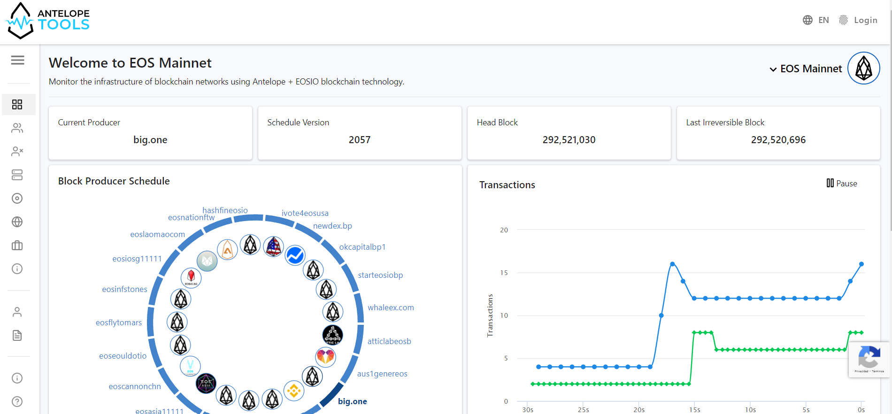
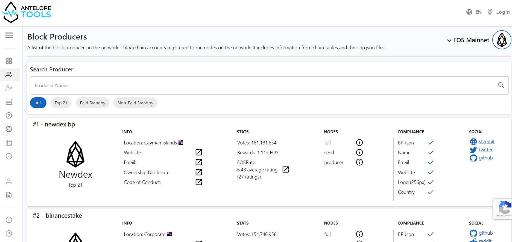

## EOS Rate

[EOS Rate](https://eosrate.io) es una herramienta visual de calificación manejada por la comunidad que permite a los titulares de los tokens de EOS calificar fácilmente a los Productores de Bloques en distintas categorías.

- **Sitio web** : https://eosrate.io

- **GitHub** : https://github.com/eoscostarica/eos-rate

* * *

## TestNet de LatamLink

El propósito de LatamLink es ofrecer una red de prueba basada en EOSIO para resaltar los beneficios de esta plataforma. LACChain es una iniciativa de BID Labs (parte del Banco Inter-Americano de Desarrollo) cuyo propósito es acompañar y acelear el desarrollo del ecosistema de cadenas de bloques en América Latina.

- **Sitio web** : https://es.latamlink.io

- **GitHub** : https://github.com/LatamLink

* * *

## Monitor de Red de EOSIO

Un Monitor de Infraestructura EOSIO y un tablero de node.

- **GitHub** : https://github.com/eoscostarica/eosio-monitor

* * *

## EOS Foundation

Vemos a EOS Foundation como un contenedor para facilitar código, capital y conexiones en maneras que no han estado disponibles hasta entonces para la comuninad de la red principal EOS.

- **Sitio Web** : https://eos-foundation.eosio.cr

- **GitHub** : https://github.com/eoscostarica/eos-foundation

* * *

## Contrato Inteligente de Notario Digital

Este Contrato Inteligente funciona como una herramienta para cualquier usuario que desee registrar la existencia de documentos digital (textos / imágenes) en un momento específico en el tiempo.

También permite que cualquiera que posea el documento pueda validar el registro en la cadena de bloques.

- **GitHub** : https://github.com/eoscostarica/notarioeoscr

* * *

## EOSIO hackathons

### LifeBank

Lifebank es una aplicación basada en EOSIO que ayuda a las comunidades locales a crear un círculo virtuoso de intercambio de valores entre tres partes: donantes de vida elegibles, centros de donación comunitarios y empresas locales participantes (patrocinadores).

Lifebank es una iniciativa de EOS Costa Rica, una compañía que desarrolla soluciones basadas en blockchain para resolver problemas del mundo real. Lifebank es nuestra entrada al desafío Codificación para el cambio organizado por la empresa líder de blockchain, Block.one.

- **Website** : https://lifebank.io/

- **GitHub** : https://github.com/eoscostarica/lifebank

* * *

## Componentes de React para EOSIO

- **Sitio Web** : https://components.eosio.cr

- **GitHub** : https://github.com/eoscostarica/eoscr-components
